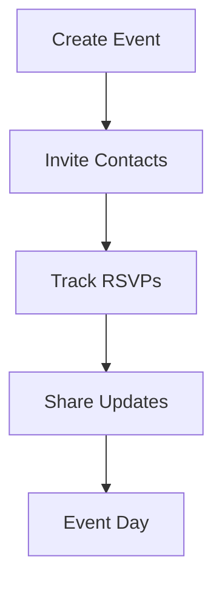

## Overview

Bk helps you reconnect with old friends, ex-classmates, neighbors, and colleagues through powerful tools designed for discovery, communication, and organization. You can filter searches precisely, chat securely in groups, manage your privacy settings, and plan events effortlessly. These features work across web and mobile platforms for a consistent experience.

<Columns cols={2}>
  <Card title="Advanced Search Filters" icon="search" href="#advanced-search">
    Find people using criteria like school, location, and graduation year.
  </Card>
  <Card title="Messaging and Groups" icon="messages-square" href="#messaging-groups">
    Send direct messages or create group chats for discussions.
  </Card>
  <Card title="Privacy Controls" icon="shield" href="#privacy-controls">
    Customize who views your profile and connection requests.
  </Card>
  <Card title="Event and Reunion Tools" icon="calendar" href="#event-tools">
    Schedule reunions and track attendance seamlessly.
  </Card>
</Columns>

## Advanced Search Filters

Locate specific contacts quickly with multi-layered filters. Combine options like name, school attended, workplace history, and location to narrow results.

<Steps>
  <Step title="Access Search" icon="search">
    Open the search bar from the top navigation.
  </Step>
  <Step title="Apply Filters">
    Select filters such as `graduationYear > 2010` and `location = "New York"`.
  </Step>
  <Step title="Review Results">
    Sort by relevance or recent activity.
  </Step>
</Steps>

<Callout kind="tip">
  Save frequent filter combinations as presets for one-click access.
</Callout>

## Messaging and Groups

Communicate privately or in communities. Direct messages support rich media, while groups allow up to 500 members.

<Tabs>
  <Tab title="Direct Message" icon="message-circle">
    Start a one-on-one chat by selecting a contact.

    ```
    1. Click the contact's profile.
    2. Select "Message".
    3. Type and send.
    ```
  </Tab>
  <Tab title="Create Group" icon="users">
    Build a group for classmates.

    ```
    1. Tap "New Group".
    2. Add members from search.
    3. Set group name and privacy.
    ```
  </Tab>
</Tabs>

## Privacy Controls

Protect your information with granular settings. Decide who sees your profile details and connection requests.

| Setting | Description | Default |
|---------|-------------|---------|
| Profile Visibility | Public, connections only, or private | Connections only |
| Connection Requests | Auto-accept from classmates, manual otherwise | Manual |
| Data Sharing | Opt-in for professional networking | Opt-out |

<Expandable title="Advanced Privacy Options" default-open="false">

Adjust settings via account preferences:

- Block specific users.
- Limit search discoverability.
- Enable two-factor authentication.

</Expandable>

## Event and Reunion Tools

Organize gatherings with built-in tools. Create events, invite via Bk, and manage RSVPs.

```

```

<Callout kind="success">
  Integrated calendar syncs with Google and Apple Calendar.
</Callout>

These features make Bk your go-to platform for meaningful reconnections. Start exploring today to build lasting networks.